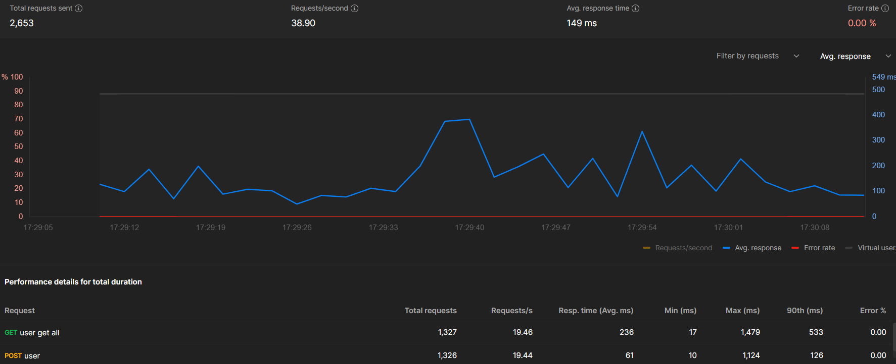
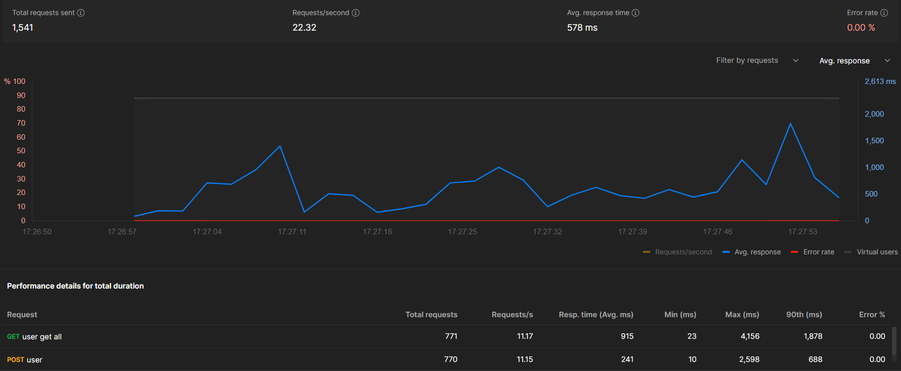

# CPU 부하 테스트

## 테스트 환경
쉘 스크립트를 사용하여 CPU의 갯수를 입력받아 부하를 유발하는 방식으로 진행되었으며, 총 60초 동안 CPU 사용률을 측정했습니다.
- 운영체제: Ubuntu 22.04
- 테스트 도구: stress, postman
- 테스트 시간: 60초
- 하드웨어 사양:
  - 프로세서: 2 개
  - 메모리: 16GB
- 테스트 가상 유저 수 : 30
- 부하 cpu 갯수 : 2

## CPU 부하 Before

## CPU 부하 After

